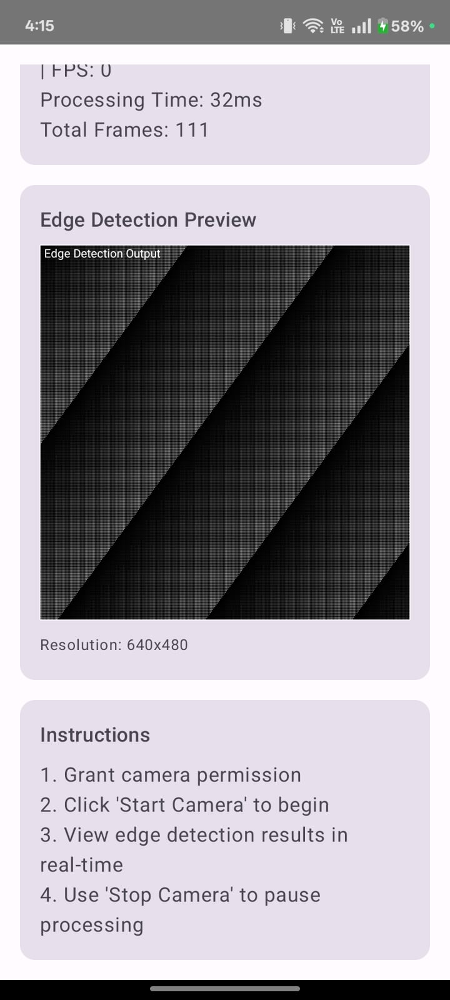
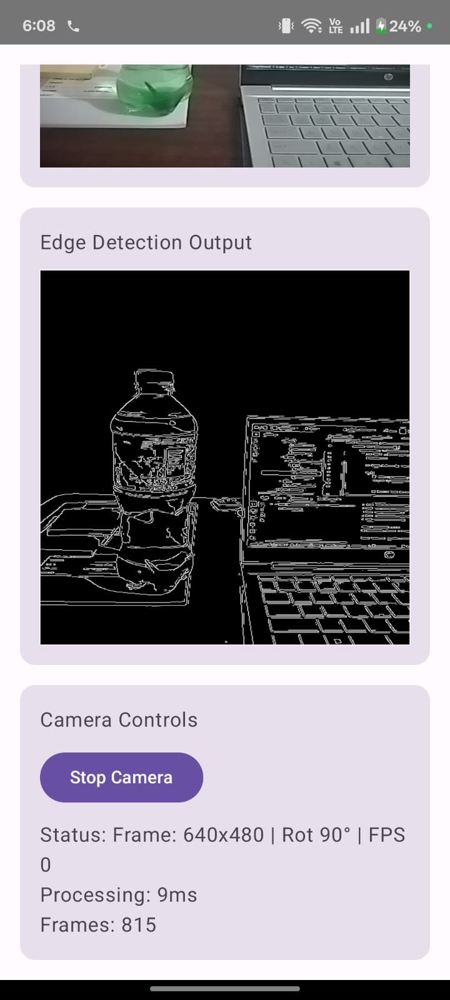

# EdgeViewer – Real-Time Edge Detection (Android + Native C++ + Web)

EdgeViewer is a real-time visual processing system built with Android Camera2, Jetpack Compose, and OpenCV (C++ via NDK). It also includes an optional web interface built with Next.js and OpenCV.js.

---

## Overview

EdgeViewer captures real-time camera frames on Android, sends them through a native C++ OpenCV pipeline, performs operations such as Canny edge detection, and displays the processed output in real time.  
An optional web interface allows browser-based image edge detection using OpenCV.js.

---

## Screenshots

| Camera Preview | Edge Output | 
|----------------|-------------|
|  |  |

---

## YouTube Demo

(https://www.youtube.com/shorts/EDxmlGY6Lww

---


## Features

### Android Application
- Real-time frame processing using Camera2 API  
- Native C++ (OpenCV 4.x) processing pipeline  
- Edge detection using Canny  
- Jetpack Compose UI  
- FPS and processing-time indicators  
- Camera start/stop controls  
- Optimized NV21 → RGBA conversion  
- Rotation handling to match camera preview  
- Compatible with ARMv7 and ARM64 devices  

### Web Interface
- Next.js 14 + TypeScript  
- Drag-and-drop or file upload  
- Real-time edge detection using OpenCV.js  
- Adjustable threshold and kernel size  
- Download processed output  

---

## Project Structure

```bash
EdgeViewer/
│
├── app/ # Android application
│ ├── src/main/
│ │ ├── java/com/hamsa/edgeviewer/
│ │ │ ├── MainActivity.kt # UI + camera control
│ │ │ ├── CameraHelper.kt # Camera2 frame pipeline
│ │ │ └── NativeBridge.kt # JNI → C++ communication
│ │ │
│ │ ├── cpp/
│ │ │ ├── native-lib.cpp # JNI + OpenCV pipeline
│ │ │ ├── opencv_processor.* # (Optional) C++ utilities
│ │ │ └── gl_renderer.* # (Optional) OpenGL renderer
│ │ │
│ │ └── res/ # Compose themes, icons, etc.
│ │
│ └── build.gradle.kts # Android module build config
│
├── web/ # Optional Web Interface
│ ├── src/app/ # Next.js pages
│ ├── src/components/ # UI components
│ ├── package.json
│ └── README.md
│
├── opencv/ # OpenCV Android SDK (ignored)
├── gradle/
└── build.gradle.kts # Root build config
```
---

---

## Requirements

### Android
- Android Studio 2023 or newer  
- SDK 34  
- Minimum SDK 24  
- NDK 23 or higher  
- CMake 3.22.1 or higher  
- OpenCV Android SDK 4.x
  
 ---
 
### Web
```bash
- Node.js 18+  
- npm or yarn  
```
---

## Android Setup

### Clone the repository
```bash
git clone https://github.com/hamsa-20/EdgeViewer.git

cd EdgeViewer
```
---


### Open in Android Studio
1. Open Android Studio  
2. Select “Open Existing Project”  
3. Choose the `EdgeViewer` folder  

---

### Configure OpenCV
1. Download OpenCV Android SDK (4.x)  
2. Extract it  
3. Place the folder at:

```bash
app/opencv/sdk/native/
```

Your path should look like:
```bash
app/opencv/sdk/native/libs/arm64-v8a/libopencv_java4.so
```
---


### Build the project

```bash
./gradlew clean
./gradlew :app:assembleDebug
```
---


### Run on device

1. Enable USB debugging  
2. Connect the device  
3. Press Run in Android Studio  

---

## Web Setup (Optional)

```bash
cd web
npm install
npm start
```
--- 
Open:http://localhost:3000


---

## Android Processing Pipeline
```bash
Jetpack Compose UI
↓
Camera2 (YUV_420_888)
↓
ImageReader → NV21 buffer
↓
JNI Bridge → native-lib.cpp
↓
OpenCV C++ (Canny / Sobel / Gaussian)
↓
RGBA byte array
↓
Bitmap → Compose Canvas

```
---


## Web Processing Pipeline
```bash
Next.js UI
↓
File upload
↓
OpenCV.js
↓
Canny edge detection
↓
Canvas rendering
↓
Download button
```

---

## Algorithms Used

- Canny edge detection  
- Gaussian Blur  
- Sobel operator  
- Manual NV21 → RGBA conversion  
- Frame skipping for performance  
- Bitmap rotation correction  

---

## Build Commands

### Android

```bash
./gradlew clean
./gradlew assembleDebug
```

---

### Web
```bash
npm run dev
npm run build
```


---

## Testing

### Android

```bash
./gradlew test
./gradlew connectedAndroidTest
```


---

### Web

```bash
npm run lint
npx tsc --noEmit
```


---

## Supported Platforms

### Android  
- API 24 – 34  
- ARM64-v8a  
- armeabi-v7a  

### Web  
- Chrome  
- Firefox  
- Safari  
- Edge  

---


